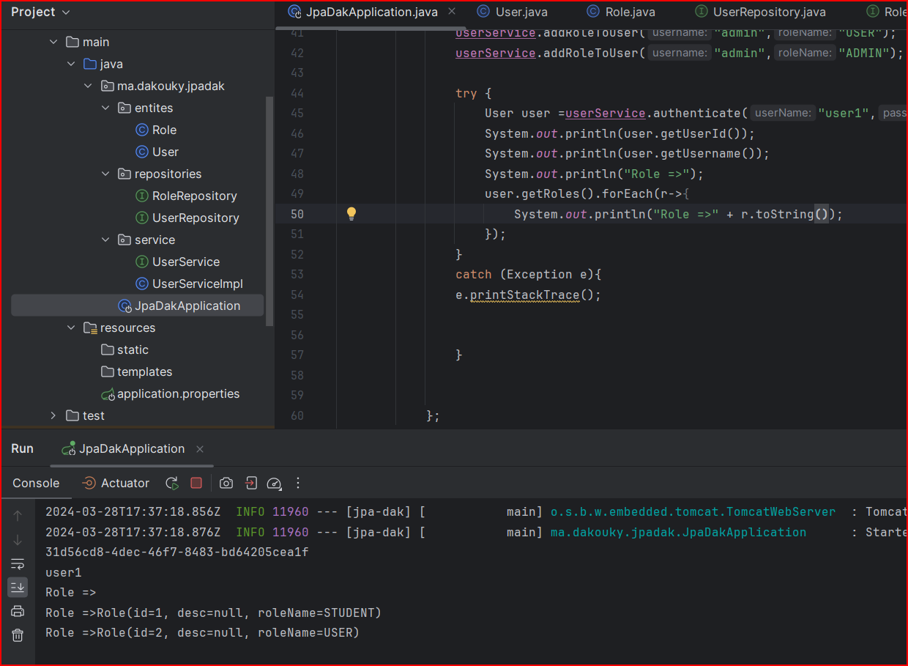
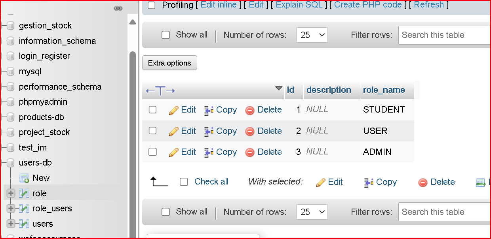
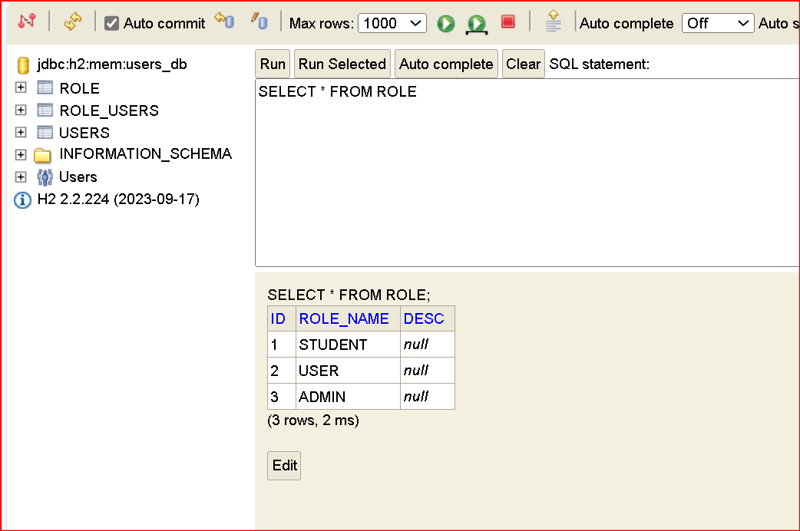
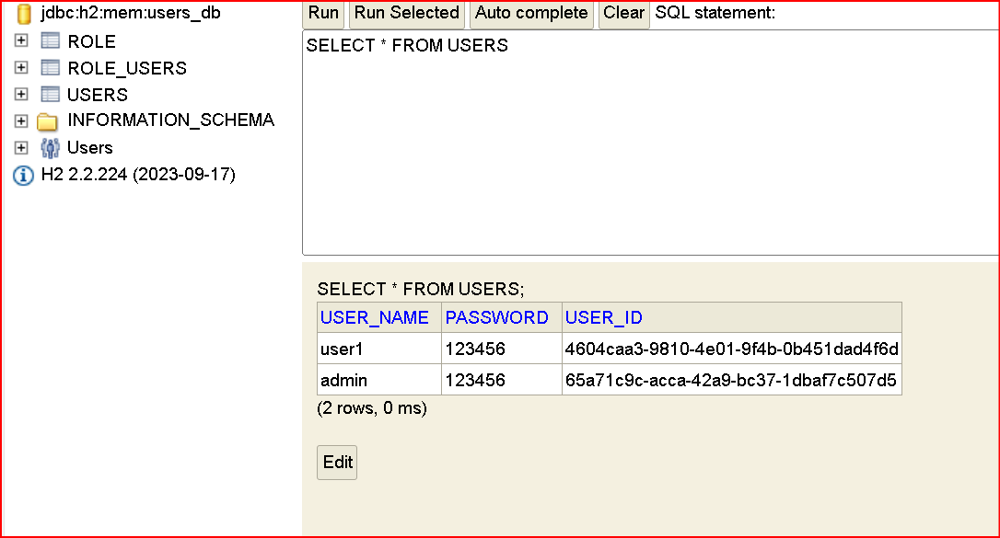
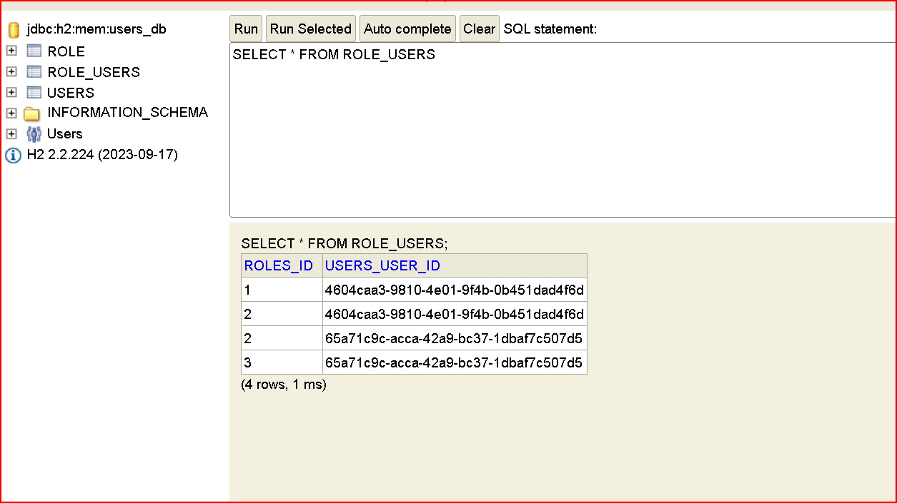
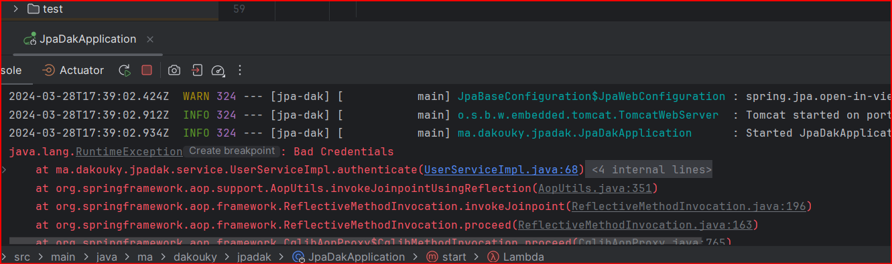
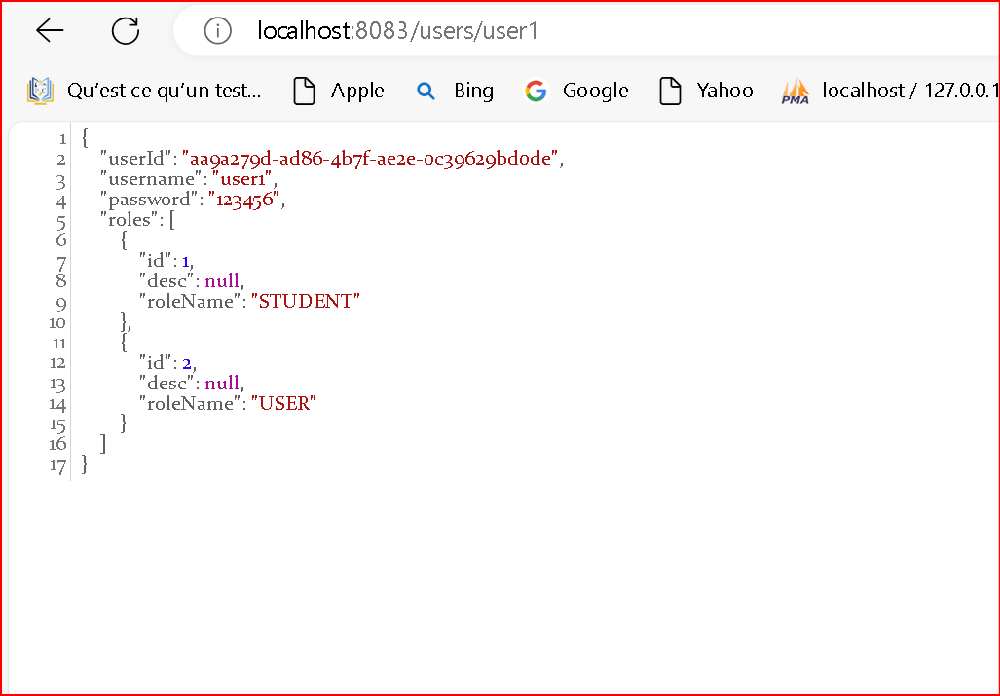
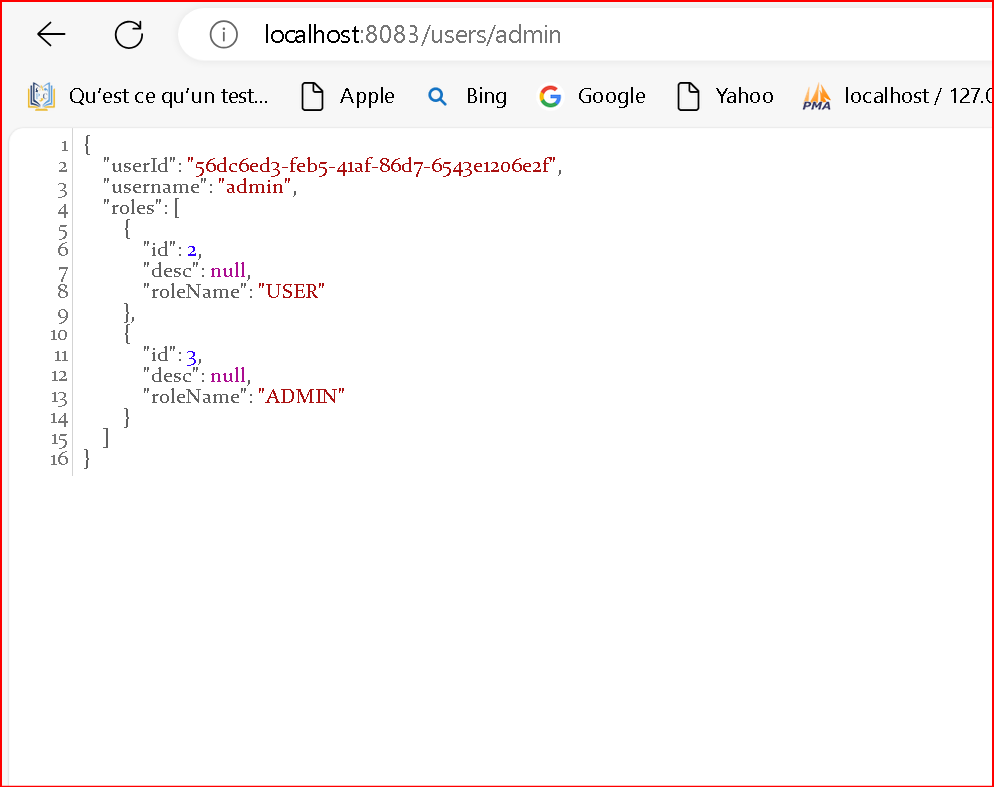

# Use Case JPA Hibernate Spring Data Many To Many Case

## authenticate

## migrationDBMysql

## Effectation Roles

## Effectation Users

## Roles Users

## Password N'Existe Pas

## Web

## webEtAfficePasPassword

